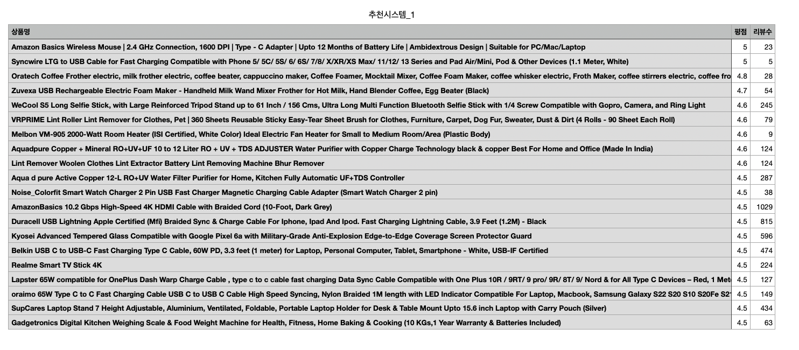
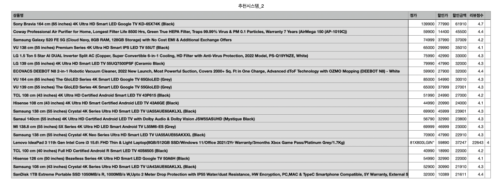
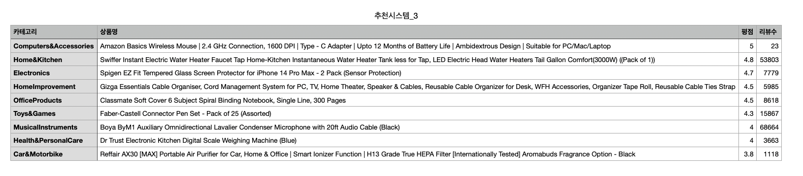
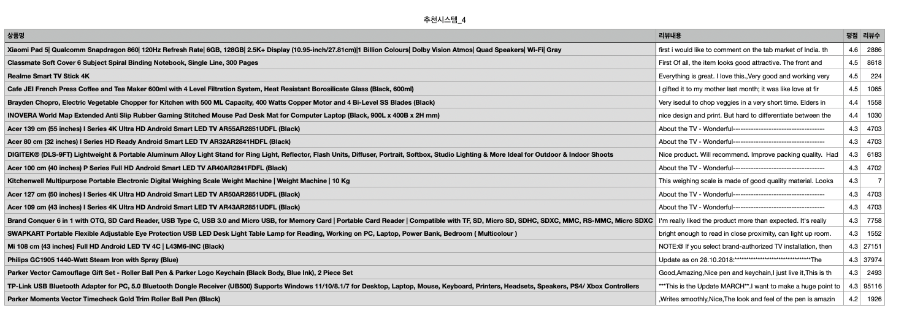
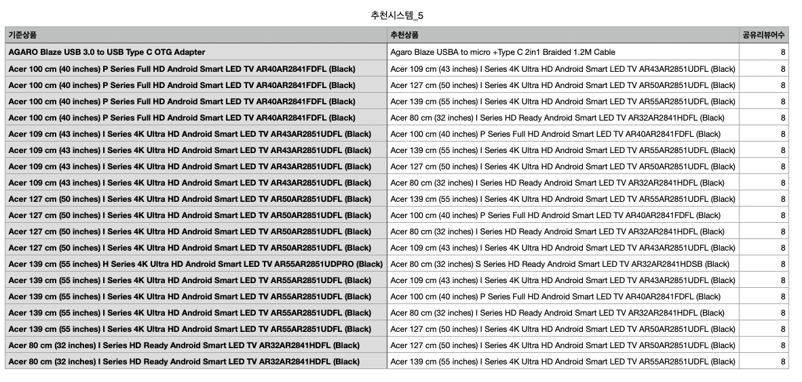

# Amazon 판매 데이터 기반 추천 시스템 설계

> 작성: 정유빈 · 데이터 인텔리전스 1기 · SQL 실무 과제
> 분석 환경: LMS SQL Lab (DuckDB) · 데이터: Amazon Sales Dataset (1,465행 · 16개 컬럼)

---

## 1. 프로젝트 개요

Amazon 상품·리뷰 데이터를 SQL만으로 분석해, 서로 다른 관점의 추천 시스템 5종을 설계했다.

작업 순서는 **데이터 구조·품질 확인(EDA) → 발견을 근거로 설계 방향 결정 → SQL 구현 → 결과 해석**이다. 5종은 각각 다른 컬럼과 다른 관점을 사용하도록 의도적으로 분산 설계했으며, 3장의 EDA 항목과 1:1로 대응한다.

| # | 추천 시스템 | 핵심 관점 | 주요 컬럼 | 근거 EDA |
|---|---|---|---|---|
| 1 | 아직 안 알려진 숨은 명품이에요 | 평점 대비 저노출 | rating · rating_count | 3-2 |
| 2 | 지금 사면 가장 많이 아껴요 | 할인율이 아닌 절약 금액 | actual_price · discounted_price | 3-4 |
| 3 | 분야별 1등만 모았어요 | 카테고리 내 상대 순위 | category | 3-3 |
| 4 | 선물로 많이 고르는 상품이에요 | 리뷰 텍스트의 구매 상황 | review_content | 3-5 |
| 5 | 이 상품을 본 사람이 함께 본 상품이에요 | 리뷰어 공유 기반 연관성 | user_id | 3-6 |

---

## 2. 데이터 개요

**데이터셋**: Amazon Sales Dataset — 1,465행, 16개 컬럼, 단일 테이블 구조

이 데이터에는 분석 방향을 결정적으로 제약하는 특성이 두 가지 있다.

### 구매 이력이 존재하지 않는다

주문·판매량 컬럼이 없다. 따라서 "이 상품을 구매한 사람이 함께 구매한 상품" 형태의 전통적 장바구니 분석은 **이 데이터로는 불가능하다.**

사용자 행동에 접근할 수 있는 유일한 통로는 `user_id`(리뷰 작성자 목록)이며, 이들은 **구매자가 아니라 리뷰어**다. 이 구분은 5번 추천의 해석에 직접 영향을 주므로, 본 보고서에서는 사용자 기반 추천을 일관되게 "구매 패턴"이 아닌 **"리뷰 패턴"**으로 서술한다.

또한 판매량이 없으므로 인기도의 대리 지표로 `rating_count`(리뷰 수)를 사용했다. "리뷰를 많이 남겼다 = 많이 팔렸다"는 가정에 기반하며, 리뷰 작성률이 카테고리·가격대별로 다를 수 있다는 점은 한계로 남는다.

### 한 칸에 여러 값이 들어 있다

| 컬럼 | 저장 형태 | 처리 방법 |
|---|---|---|
| `category` | `Computers&Accessories\|Accessories&Peripherals\|Cables\|USBCables` | `string_split`으로 대·중·세부 분류 분리 |
| `user_id` | `AG3D6O4S…,AHMY5CWJ…,AHCTC6UL…` | `unnest`로 행 단위 전개 |

`category`는 파이프(`|`)로 구분된 계층 문자열이고, `user_id`는 쉼표로 연결된 리뷰어 목록이다. 두 컬럼 모두 그대로는 집계·조인에 쓸 수 없어 전처리 단계에서 분해했다.

---

## 3. EDA — 탐색적 데이터 분석

EDA의 목적은 데이터를 나열하는 것이 아니라 **각 추천 시스템의 설계 근거를 확보하는 것**에 두었다.

### 3-1. 데이터 품질 점검

먼저 분석이 가능한 상태인지부터 확인했다. 결과는 다음과 같다.

| 점검 항목 | 결과 | 대응 |
|---|---|---|
| 컬럼 타입 | 16개 전체 VARCHAR (`₹1,099`, `64%`, `24,269` 형태) | 전처리에서 형변환 |
| 평점 이상치 | 1건 (숫자 변환 불가) | `TRY_CAST`로 NULL 처리 |
| 리뷰 수 결측 | 2건 (`B0B94JPY2N`, `B0BQRJ3C47`) | 각 쿼리에서 NULL 필터 |
| 이미지 결측 | 0건 — 전 상품에 존재 | 비교군 부재로 추천 기준 미채택 |
| 상품 중복 | 1,465행 중 고유 1,351개 (114행 중복) | 최종 조회에 `DISTINCT` 적용 |

수치 비교를 시도하면 다음 에러가 발생했다. 형변환이 선행되어야 함을 확인한 지점이다.

```
Binder Error: Cannot compare values of type VARCHAR and type DECIMAL(2,1)
 - an explicit cast is required
```

**`CAST`가 아니라 `TRY_CAST`를 쓴 이유** — 평점 이상치 1건 때문에 일반 `CAST`는 쿼리 전체를 중단시킨다. `TRY_CAST`는 변환 실패 행만 NULL로 처리하고 나머지를 정상 반환한다.

**중복의 성격** — 동일 `product_id`가 서로 다른 카테고리 경로로 여러 번 등재된 경우였다(예: WeCool S5 셀피스틱은 2개 경로에 등재). 행 전체가 완전히 동일하지는 않아 `SELECT DISTINCT *`로는 제거되지 않는다. 추천 목록에 같은 상품이 반복 노출되는 문제를 일으키므로 조회 단계에서 대응했다.

**이미지 분석을 폐기한 이유** — 이미지 유무와 평점의 관계를 보려 했으나 전 상품에 이미지가 존재해 비교군이 없었다. 확인하지 않고 넘긴 것이 아니라, 확인한 결과 사용할 수 없다고 판단한 것이다.

> **전처리**: 위 점검을 근거로 숫자 컬럼을 변환하고 카테고리 계층을 분리한 분석용 테이블 `clean`을 구축했다. 이후 5종의 추천 쿼리는 모두 이 테이블을 기준으로 작성했다. (전처리 SQL은 부록)

### 3-2. 리뷰 수 분포 — 최대값이 중앙값의 82배

```sql
SELECT
  MIN(rating_count_num)        AS 최소리뷰수,
  MAX(rating_count_num)        AS 최대리뷰수,
  ROUND(AVG(rating_count_num)) AS 평균,
  MEDIAN(rating_count_num)     AS 중앙값
FROM clean;
```

| 최소 | 최대 | 평균 | 중앙값 |
|---|---|---|---|
| 2 | 426,973 | 18,296 | 5,179 |

최대값이 중앙값의 **82배**, 평균이 중앙값의 3.5배다. 평균이 중앙값을 크게 상회하는 것은 분포가 오른쪽으로 심하게 치우쳤다는 뜻이다. 소수의 유명 상품이 리뷰를 독점하고, 절반 이상의 상품은 5,179건 이하에 머문다.

따라서 리뷰 수 기준 정렬은 항상 같은 소수의 상품만 노출한다. 반대로 평점만으로 정렬하면 리뷰 1건에 5.0점인 상품이 1위가 되어 신뢰할 수 없다. 두 지표를 함께 봐야 한다는 판단에서 **① 숨은 명품 추천**을 설계했다.

### 3-3. 카테고리 분포 — 상위 3개가 97.4% 점유

```sql
SELECT
  main_category AS 대분류,
  COUNT(*)      AS 상품수,
  ROUND(COUNT(*) * 100.0 / SUM(COUNT(*)) OVER (), 1) AS 비중
FROM clean
GROUP BY main_category
ORDER BY 상품수 DESC;
```

| 대분류 | 상품수 | 비중(%) |
|---|---|---|
| Electronics | 526 | 35.9 |
| Computers&Accessories | 453 | 30.9 |
| Home&Kitchen | 448 | 30.6 |
| OfficeProducts | 31 | 2.1 |
| MusicalInstruments | 2 | 0.1 |
| HomeImprovement | 2 | 0.1 |
| Toys&Games | 1 | 0.1 |
| Car&Motorbike | 1 | 0.1 |
| Health&PersonalCare | 1 | 0.1 |

상위 3개 대분류가 전체의 **97.4%**를 차지한다. 나머지 6개는 합쳐서 38건(2.6%)이며 그중 **5개는 상품이 1~2건뿐**이다.

전체 평점 순위를 그대로 노출하면 목록이 상위 3개 카테고리로 도배되고, 나머지 6개 카테고리 상품은 사실상 노출 기회를 얻지 못한다. 카테고리별로 순위를 따로 매기는 **③ 분야별 1등 추천**을 설계한 근거다.

### 3-4. 할인율과 절약 금액의 불일치 — 13배 차이

```sql
SELECT
  product_name  AS 상품명,
  discount_pct  AS 할인율,
  saving_amount AS 절약액
FROM clean
WHERE discount_pct IS NOT NULL AND saving_amount IS NOT NULL
ORDER BY discount_pct DESC
LIMIT 5;
```

| 상품명 | 할인율(%) | 절약액(₹) |
|---|---|---|
| rts Mini USB C Type C Adapter Plug (2 Pack) | 94 | 4,705 |
| Fire-Boltt Ninja Call Pro Plus Smart Watch | 91 | 18,200 |

할인율 1위 상품(94%)의 절약액은 **₹4,705**인데, 절약액 기준 1위(Sony Bravia 65" TV, 할인율 44%)는 **₹61,910**으로 **13배** 크다. 전체 평균 절약액은 ₹2,320이다.

할인율은 저가 상품에 구조적으로 유리한 지표다. 사용자가 체감하는 이득은 비율이 아니라 금액이라는 판단에서 **② 절약 금액 추천**을 별도로 설계했다.

### 3-5. 리뷰 텍스트의 상황 언급 — 검색 대상 컬럼의 선택

선물 관련 언급 규모를 리뷰 제목으로 집계했더니 **5건(0.3%)**뿐이었다. 추천 목록을 구성할 수 없는 규모다.

원인은 `review_title`이 리뷰 제목만 짧게 연결한 필드여서 본문 표현을 포착하지 못한 것이었다. 검색 대상 컬럼과 키워드 범위를 바꿔가며 검출량을 비교했다.

| 검색 대상 | 키워드 | 검출 상품 수 | 비중 |
|---|---|---|---|
| `review_title` | gift | 5 | 0.3% |
| `review_title` | gift · present · birthday | 6 | 0.4% |
| `review_content` | gift | 24 | 1.6% |
| `review_content` | gift · present · birthday | **66** | **4.5%** |

리뷰 **본문**을 대상으로 키워드를 확장하면 66건(4.5%)이 검출된다. 제목 대비 13배다. 이 규모라면 별도 추천을 구성할 수 있다고 판단해 `review_content`를 대상으로 하는 **④ 상황 기반 추천**을 설계했다.

이 비교 과정 자체가 "어느 컬럼을 근거로 삼을 것인가"라는 설계 판단의 근거가 되었다.

### 3-6. 리뷰어 중복 — 연관 분석 가능성 검증

사용자 기반 추천이 이 데이터로 성립하는지를 **설계 전에 먼저** 확인했다. 리뷰어가 여러 상품에 걸쳐 등장하지 않으면 연관 분석 자체가 불가능하기 때문이다.

```sql
WITH r AS (
  SELECT product_id, TRIM(unnest(string_split(user_id, ','))) AS reviewer
  FROM clean
)
SELECT COUNT(*) AS 겹치는리뷰어수
FROM (
  SELECT reviewer FROM r
  GROUP BY reviewer HAVING COUNT(DISTINCT product_id) >= 2
);
```

2개 이상 상품에 등장하는 리뷰어가 **911명** 확인되었다. 이어서 리뷰어별 등장 상품 수의 상위 분포를 보면 **9개 상품에 등장하는 리뷰어 2명, 8개 상품에 등장하는 리뷰어 6명**이 있다.

이 "8"이라는 수치는 이후 5번 추천의 결과를 해석하는 결정적 단서가 된다. (4-5 참조)

리뷰어를 매개로 상품을 연결하는 협업 필터링이 성립함을 확인하고 **⑤ 연관 상품 추천**을 설계했다.

### 3-7. EDA 종합

| EDA 발견 | 도출한 설계 방향 |
|---|---|
| 16개 컬럼 전체 VARCHAR, 평점 결측 1건, 리뷰수 결측 2건 | 전처리 테이블 선행 구축 + NULL 필터 적용 |
| 동일 상품 114행 중복 등재 | 최종 조회에 `DISTINCT` 적용 |
| 리뷰 수 최대값이 중앙값의 82배 | ① 저노출 우수 상품 발굴 |
| 할인율 1위와 절약액 1위의 금액이 13배 차이 | ② 절약 금액 기준 추천 |
| 상위 3개 대분류가 전체의 97.4% 점유 | ③ 카테고리별 균등 노출 |
| 선물 언급이 본문 기준 4.5% (제목 기준 0.3%) | ④ 본문 기반 상황 추천 |
| 리뷰어 911명 중복 등장, 최대 9개 상품 | ⑤ 리뷰어 공유 연관 추천 |
| 이미지 결측 0건 — 비교군 부재 | 채택하지 않음 |


## 4. 추천 시스템

### 4-1. "아직 안 알려진 제품"

**테마**

품질은 검증되었으나 아직 충분히 노출되지 않은 상품을 발굴한다. 리뷰 수 기준 정렬로는 절대 상위에 오를 수 없는 상품들이다.

사용자에게는 "남들이 모르는 좋은 물건을 찾았다"는 발견의 경험을 제공하고, 서비스 관점에서는 리뷰가 적어 노출이 어려운 신규·소규모 판매자 상품에 유입 기회를 만든다. 리뷰가 많은 상품만 계속 노출되는 구조에서 발생하는 부익부 순환을 완화하는 역할이다.

**구현 로직**

평점과 리뷰 수를 각각 `NTILE(4)`로 4분위로 나눈 뒤, **평점은 최상위 분위이면서 리뷰 수는 최하위 분위**인 상품만 추출했다.

기준을 임의의 절대값(예: "평점 4.5 이상, 리뷰 100건 이하")으로 정하지 않고 분위수를 사용했다. 절대값은 "왜 4.5인가"라는 근거를 댈 수 없지만, 분위수는 데이터 분포가 스스로 기준을 정하므로 임의성이 없다.

또한 리뷰 수는 `DESC`로 정렬해 등급 방향을 평점과 일치시켰다. 리뷰 수는 작을수록 우수한(=숨어 있는) 지표이므로 그냥 정렬하면 "리뷰가 많은 상품이 1등급"이 되어 방향이 반대가 된다. `DESC`로 뒤집어 **양쪽 모두 4등급이 우수**하도록 맞췄고, 조건식이 `= 4 AND = 4`로 통일되어 가독성이 확보되었다.

```sql
WITH scored AS (
  SELECT
    product_id,
    product_name,
    rating_num,
    rating_count_num,
    NTILE(4) OVER (ORDER BY rating_num)            AS 평점등급,
    NTILE(4) OVER (ORDER BY rating_count_num DESC) AS 리뷰희소등급
  FROM clean
  WHERE rating_num IS NOT NULL
    AND rating_count_num IS NOT NULL
)
SELECT DISTINCT
  product_name     AS 상품명,
  rating_num       AS 평점,
  rating_count_num AS 리뷰수
FROM scored
WHERE 평점등급 = 4
  AND 리뷰희소등급 = 4
ORDER BY rating_num DESC
LIMIT 20;
```

**구현 중 발견한 오류와 수정**

초기 쿼리는 `rating_num IS NOT NULL`만 적용했다. 이 상태에서 리뷰 수가 결측인 상품 2건이 결과에 포함되었고, 실제로 REDTECH USB-C 케이블(평점 5.0, 리뷰 수 결측)이 **결과 2위**에 노출되었다.

원인은 `NTILE`의 NULL 처리 방식이었다. NULL은 정렬 시 최후순위로 밀리는데, `ORDER BY rating_count_num DESC` 기준에서 최후순위는 곧 **최상위 분위(=리뷰가 가장 희소한 그룹)**가 된다. 즉 리뷰 수를 알 수 없는 상품이 "리뷰가 가장 적은 상품"으로 오분류된 것이다.

`rating_count_num IS NOT NULL` 조건을 추가해 제거했다. NULL은 "값이 작음"이 아니라 "값을 모름"이므로 분위수 계산 전에 배제하는 것이 타당하다.

또한 EDA 3-1에서 확인한 중복 등재 문제로 20행 중 고유 상품이 17개뿐이었다. `SELECT DISTINCT`를 적용해 20개 고유 상품이 노출되도록 수정했다.

**결과**


조건을 충족하는 상품은 총 71건이며, 그중 평점 상위 20건을 노출했다.

| 상품명 | 평점 | 리뷰수 |
|---|---|---|
| Syncwire LTG to USB Cable | 5.0 | 5 |
| Amazon Basics Wireless Mouse | 5.0 | 23 |
| Oratech Coffee Frother electric | 4.8 | 28 |
| Zuvexa USB Rechargeable Electric Foam Maker | 4.7 | 54 |
| VRPRIME Lint Roller Lint Remover | 4.6 | 79 |
| Aquadpure Copper + Mineral RO+UV+UF | 4.6 | 124 |
| WeCool S5 Long Selfie Stick | 4.6 | 245 |
| Melbon VM-905 2000-Watt Room Heater | 4.6 | 9 |

**결과 해석**

의도한 구간이 정확히 포착되었다. 평점은 4.3~5.0으로 최상위권이면서 리뷰 수는 5~1,065건에 분포한다. 전체 중앙값이 5,179건임을 고려하면 **모든 결과가 리뷰 수 중앙값 이하**에 위치한다.

특히 눈에 띄는 것은 1위 Syncwire 케이블(평점 5.0, 리뷰 5건)과 Melbon 룸히터(평점 4.6, 리뷰 9건)다. 리뷰가 10건 미만이라 어떤 인기순 정렬에서도 노출될 수 없는 상품이지만 평점만 보면 최상위권이다. 이 추천이 없다면 사용자가 이 상품들을 발견할 경로는 사실상 없다.

카테고리 구성을 보면 Computers&Accessories(케이블·마우스·거치대)와 Home&Kitchen(주방 소가전)이 다수다. 저가 액세서리류가 리뷰 축적이 어려운 반면 만족도는 높게 형성되는 경향이 반영된 것으로 보인다.

**한계**

리뷰 수를 노출도의 대리 지표로 사용했으나 실제 노출량·판매량 데이터가 아니다. 리뷰가 적은 이유가 "노출이 적어서"인지 "최근 출시라서"인지, 아니면 "구매자가 리뷰를 남기지 않는 카테고리라서"인지 구분할 수 없다.

더 근본적인 문제는 **평점의 신뢰도**다. 리뷰 5건의 평점 5.0과 리뷰 2만 건의 평점 4.3 중 어느 쪽이 실제로 우수한지 이 데이터만으로는 단정할 수 없다. 표본이 작을수록 평점의 분산이 크기 때문이다. 즉 이 추천이 발굴한 상품 중 일부는 "숨은 명품"이 아니라 단순히 "평가가 덜 검증된 상품"일 수 있다.

실서비스 적용 시에는 베이지안 평균으로 리뷰 수를 평점에 반영해 보정하거나, 최소 리뷰 수 하한(예: 5건 이상)을 두어 극단적 소표본을 배제하는 보완이 필요하다.

---

### 4-2. "지금 사면 가장 많이 아껴요"

**테마**

할인율(%)이 아니라 **실제 절약 금액**을 기준으로 추천한다.

할인율은 저가 상품에 구조적으로 유리한 지표다. 5천원 상품을 90% 할인해도 절약액은 4,500원이지만, 10만원 상품을 10% 할인하면 1만원을 아낀다. 사용자가 지갑에서 체감하는 이득은 비율이 아니라 금액이며, "지금 구매를 결정할 이유"를 만드는 것도 금액이다. 대형 구매를 고민하는 사용자에게 결정 근거를 제공하는 것이 목적이다.

**구현 로직**

전처리 단계에서 `actual_price_num - discounted_price_num`을 `saving_amount` 파생 컬럼으로 미리 계산해두고 이를 기준으로 정렬했다. 매 쿼리마다 긴 형변환 식을 반복하지 않도록 전처리에서 한 번 처리한 것이다.

단순히 절약액만으로 정렬하면 품질이 검증되지 않은 고가 상품이 상위에 오를 수 있으므로, **평점 4.0 이상 · 리뷰 5건 이상** 조건으로 검증된 상품 범위 내에서 순위를 매겼다. 리뷰 5건 하한은 평점이 최소한의 표본에 근거하도록 하기 위한 것이다.

```sql
SELECT
  product_name         AS 상품명,
  actual_price_num     AS 정가,
  discounted_price_num AS 할인가,
  saving_amount        AS 절약액,
  rating_num           AS 평점
FROM clean
WHERE rating_num >= 4
  AND rating_count_num >= 5
  AND saving_amount IS NOT NULL
ORDER BY saving_amount DESC
LIMIT 20;
``` 

**결과**


20건이 추출되었다.

| 상품명 | 정가 | 할인가 | 절약액 | 평점 |
|---|---|---|---|---|
| Sony Bravia 65" 4K Google TV | 139,900 | 77,990 | **61,910** | 4.7 |
| Coway Professional Air Purifier | 59,900 | 14,400 | 45,500 | 4.4 |
| Samsung Galaxy S20 FE 5G | 74,999 | 37,990 | 37,009 | 4.2 |

**결과 해석**

상위권이 전량 고가 상품(TV·공기청정기·스마트폰)으로 채워졌다. 20건의 정가 범위는 ₹32,000~₹139,900이고 평균 절약액은 ₹29,411이다. 전체 상품의 평균 절약액이 ₹2,320이므로 이 목록은 평균의 **12.7배** 구간에 몰려 있다.

즉 평점·리뷰 조건을 걸었음에도 **고가 상품 편중은 해소되지 않았다.** 이는 오류가 아니라 절약 금액이라는 지표의 구조적 성질이다. 절대 금액을 기준으로 삼는 한 애초에 가격이 높은 상품이 유리할 수밖에 없다.

주목할 점은 EDA 3-4에서 확인한 할인율 상위 상품(94% 할인, 절약액 ₹4,705)이 **이 목록에 단 한 건도 등장하지 않는다**는 것이다. 같은 데이터를 할인율로 보는지 절약액으로 보는지에 따라 추천 결과가 완전히 달라진다는 점이 실증되었다.

**한계**

가장 큰 한계는 고가 상품 편중이다. 저가 상품을 주로 탐색하는 사용자에게 이 추천은 전혀 유용하지 않다. 실서비스에서는 사용자의 과거 구매 가격대를 반영하거나, 가격 구간별로 절약액 순위를 분리해 제시하는 방식이 필요하다.

또한 정가(`actual_price`)가 실제 시장 거래가가 아닌 **판매자 표시가**일 가능성이 있다. 표시가를 높게 설정해 할인 폭을 과장하는 관행이 존재하므로 이 경우 절약액이 실제보다 과대 계상된다. 이를 검증하려면 가격 변동 이력 데이터가 필요하나 이 데이터셋에는 없다.

---

### 4-3. "분야별 1등만 모았어요"

**테마**

각 대분류에서 가장 평이 좋은 상품을 하나씩 제시한다.

EDA 3-3에서 확인한 대로 상위 3개 대분류가 전체 상품의 97.4%를 차지한다. 전체 평점 순위를 그대로 노출하면 목록이 이 3개 카테고리로 도배되고, 사용자는 서비스의 상품 구성을 실제보다 좁게 인식한다. 카테고리별 대표를 균등하게 노출해 **탐색의 진입점을 여러 개 만드는 것**이 목적이다. 서비스 초기 화면이나 카테고리 탐색 페이지에 적합하다.

**구현 로직**

`main_category`로 파티션을 나눈 뒤 `ROW_NUMBER()`로 카테고리 내 순위를 부여하고 1위만 추출했다. `GROUP BY`가 아니라 윈도우 함수를 쓴 이유는, 집계로 평점 최대값을 구하면 그 평점을 가진 **상품이 무엇인지**를 함께 가져올 수 없기 때문이다.

윈도우 함수는 `WHERE`절에서 직접 참조할 수 없으므로(`WHERE clause cannot contain window functions`) CTE로 감싼 뒤 외부에서 필터링했다.

정렬 기준에 `rating_count_num DESC`를 2차 조건으로 추가했다. 동일 평점 상품이 존재할 경우 1위가 비결정적으로 정해져 실행할 때마다 결과가 달라질 수 있으므로, 리뷰 수를 보조 기준으로 두어 **결과의 재현성을 확보**했다. 동시에 "평점이 같다면 더 많은 사람이 검증한 상품"이라는 합리적 선택 기준이 된다.

```sql
WITH ranked AS (
  SELECT
    product_name,
    main_category,
    rating_num,
    rating_count_num,
    ROW_NUMBER() OVER (
      PARTITION BY main_category
      ORDER BY rating_num DESC, rating_count_num DESC
    ) AS 카테고리순위
  FROM clean
  WHERE rating_num IS NOT NULL
)
SELECT
  main_category    AS 카테고리,
  product_name     AS 상품명,
  rating_num       AS 평점,
  rating_count_num AS 리뷰수
FROM ranked
WHERE 카테고리순위 = 1
ORDER BY rating_num DESC;
```

결과 건수가 카테고리 개수로 자연히 제한되므로 `LIMIT`을 두지 않았다.
**결과**


대분류 9개에 대해 각 1건씩 **총 9건**이 추출되었다.

| 카테고리 | 대표 상품 | 평점 | 리뷰수 |
|---|---|---|---|
| Computers&Accessories | Amazon Basics Wireless Mouse | 5.0 | 23 |
| Home&Kitchen | Swiffer Instant Electric Water Heater Faucet | 4.8 | 53,803 |
| Electronics | Spigen EZ Fit Tempered Glass (iPhone 14 Pro Max) | 4.7 | 7,779 |
| HomeImprovement | Gizga Essentials Cable Organiser | 4.5 | 5,985 |
| OfficeProducts | Classmate 6 Subject Spiral Notebook | 4.5 | 8,618 |
| Toys&Games | Faber-Castell Connector Pen Set | 4.3 | 15,867 |
| MusicalInstruments | Boya ByM1 Lavalier Condenser Microphone | 4.0 | 68,664 |
| Health&PersonalCare | Dr Trust Digital Kitchen Scale | 4.0 | 3,663 |
| Car&Motorbike | Reffair AX30 Portable Air Purifier | 3.8 | 1,118 |

**결과 해석**

의도한 효과가 확인되었다. 전체 평점 순위였다면 노출 자체가 불가능했던 Toys&Games·Car&Motorbike·Health&PersonalCare 상품이 목록에 포함되었다. 이 3개 카테고리는 전체 상품의 0.3%(각 1건)에 불과하다.

동시에 **대표성의 편차**가 드러났다. Computers&Accessories 대표는 평점 5.0이지만 리뷰가 23건뿐이고, MusicalInstruments 대표는 평점 4.0에 리뷰 68,664건이다. 상품이 453건인 카테고리의 1위와 2건인 카테고리의 1위는 경쟁을 통과한 강도가 전혀 다르다. 후자의 "1등"은 사실상 경쟁 없이 선정된 것이다.

또한 대표 상품의 평점 범위가 3.8~5.0으로 넓다. Car&Motorbike 대표의 평점 3.8은 전체 기준으로는 평범한 수준이지만, 해당 카테고리에 상품이 1건뿐이므로 자동으로 대표가 되었다.

**한계**

가장 큰 한계는 위에서 관찰한 대표성의 불균등이다. 상품이 1~2건인 카테고리의 "1등"은 경쟁의 결과가 아니라 유일한 선택지다. 이를 그대로 "분야별 1등"으로 제시하는 것은 사용자에게 오해를 줄 수 있다. 카테고리별 최소 상품 수(예: 10건 이상) 조건을 두거나, 상품 수가 적은 카테고리는 별도 표기하는 보완이 필요하다.

또한 대분류 단위로 묶었기 때문에 대분류 내부의 다양성은 반영되지 않는다. Computers&Accessories 하나에 케이블·마우스·키보드·거치대가 모두 포함되지만 대표는 1건만 노출된다. 상품이 453건인 카테고리와 1건인 카테고리를 동일하게 "1건씩" 취급하는 것이 균등한지에 대해서도 재검토가 필요하다. 세부 분류(`leaf_category`) 단위로 확장하거나 카테고리 규모에 비례해 노출 수를 배분하는 방식이 대안이 될 수 있다.

---

### 4-4. "선물로 많이 고르는 상품이에요"

**테마**

리뷰에 선물 관련 언급이 반복되는 상품을 모아 제시한다.

선물 구매는 자신을 위한 구매와 선택 기준이 근본적으로 다르다. 포장 상태, 받는 사람에게 주는 인상, 실패했을 때의 위험이 가격이나 사양보다 우선한다. 그런데 평점·가격·카테고리 기반 추천은 이 맥락을 전혀 반영하지 못한다.

이 추천은 숫자가 아닌 **텍스트에서 구매 상황을 읽어내는** 관점이다. 이미 선물로 구매해본 사람들의 리뷰가 남아 있다면 그것이 다음 사용자에게 가장 신뢰할 만한 근거가 된다.

**구현 로직**

`review_content`에 선물 관련 키워드(`gift` · `present` · `birthday`)가 포함된 상품을 추출하고 평점 순으로 정렬했다. `LOWER()`로 감싸 `Gift` · `GIFT` · `gifting` 등 대소문자와 활용형을 모두 포착했다.

**검색 대상 컬럼을 `review_title`에서 `review_content`로 변경했다.** EDA 3-5에서 확인한 대로 제목 기준으로는 5건(0.3%)만 검출되어 추천 목록을 구성할 수 없었고, 본문 기준으로 키워드를 확장하니 66건(4.5%)이 확보되었다. 같은 아이디어라도 어느 컬럼을 근거로 삼는지가 시스템의 성립 여부를 갈랐다.

중복 등재 상품 대응을 위해 `DISTINCT`를 적용했다.

```sql
SELECT DISTINCT
  product_name             AS 상품명,
  LEFT(review_content, 60) AS 리뷰내용,
  rating_num               AS 평점,
  rating_count_num         AS 리뷰수
FROM clean
WHERE (LOWER(review_content) LIKE '%gift%'
    OR LOWER(review_content) LIKE '%present%'
    OR LOWER(review_content) LIKE '%birthday%')
  AND rating_num IS NOT NULL
ORDER BY rating_num DESC
LIMIT 20;
```

`review_content`는 다수 리뷰가 연결된 장문 필드이므로 표시 시 `LEFT`로 절단했다.

**결과**


총 66건이 검출되었고 그중 평점 상위 20건을 노출했다.

| 상품명 | 평점 | 리뷰수 |
|---|---|---|
| Xiaomi Pad 5 (Snapdragon 860, 120Hz) | 4.6 | 2,886 |
| Cafe JEI French Press Coffee and Tea Maker | 4.5 | 1,065 |
| Realme Smart TV Stick 4K | 4.5 | 224 |
| Classmate 6 Subject Spiral Notebook | 4.5 | 8,618 |
| Brayden Chopro Electric Vegetable Chopper | 4.4 | 1,558 |
| INOVERA World Map Extended Gaming Mousepad | 4.4 | 1,030 |

66건의 카테고리 분포는 Electronics 32건, Home&Kitchen 19건, Computers&Accessories 11건, OfficeProducts 4건이다.

**결과 해석**

결과가 실제로 선물로 납득이 가는 구성이다. 태블릿, 프렌치프레스 커피메이커, TV 스틱, 전동 채칼, 디자인 마우스패드 등은 "받는 사람이 직접 사기는 망설이지만 받으면 좋은 물건"이라는 선물의 전형적 성격에 부합한다.

`Cafe JEI French Press`의 리뷰 본문에는 *"I gifted it to my mother last month"* 같은 직접적인 선물 경험 서술이 확인된다. 키워드 매칭이 실제 선물 맥락을 포착하고 있다는 증거다.

카테고리 분포에서 Electronics가 32건(48%)으로 가장 많은 것은 전체 데이터에서 Electronics 비중이 35.9%인 것을 고려하면 **선물 목적에 다소 과대 대표**되어 있다. 전자제품이 선물로 선택되는 빈도가 상대적으로 높다는 해석이 가능하다. 반면 OfficeProducts는 전체 2.1%인데 4건(6%)이 검출되어 문구류 역시 선물 비중이 높은 카테고리로 보인다.

**한계**

`review_content`가 여러 리뷰어의 본문을 연결한 필드이므로 매칭은 **"리뷰어 중 최소 1명이 선물을 언급했다"**는 의미다. 해당 상품이 선물용으로 주로 소비된다는 근거는 아니다. 언급 빈도나 전체 리뷰 대비 비율로 가중하지 않았다는 점도 한계다. 리뷰 100건 중 1건이 선물을 언급한 상품과 5건 중 3건이 언급한 상품이 동일하게 취급된다.

더 중요한 한계는 **부정 문맥을 구분하지 못한다**는 점이다. 단순 문자열 포함 방식이므로 *"not a good gift"* 나 *"wouldn't buy this as a present"* 같은 부정적 리뷰도 매칭된다.

또한 `birthday` 키워드는 선물이 아닌 다른 맥락에서도 등장할 수 있어 오검출 여지가 있다. 실서비스 적용 시에는 감성 분석을 결합해 긍정 문맥만 필터링하거나 언급 비율을 가중치로 반영하는 보완이 필요하다.

---

### 4-5. "이 상품을 본 사람이 함께 본 상품이에요"

**테마**

같은 리뷰어가 리뷰한 상품들은 취향이 연결되어 있다고 보고, 상품 상세 페이지에서 함께 검토할 만한 상품을 제안한다. 협업 필터링(collaborative filtering)의 기초 형태다.

앞의 4종이 상품 자체의 속성(평점·가격·카테고리·텍스트)에 기반한 반면, 이 추천은 **사용자 행동의 연결**에 기반한다. 이 데이터에서 사용자 행동에 접근할 수 있는 유일한 경로를 활용한 설계다.

**구현 로직**

세 단계로 구성했다.

1. `unnest`로 리뷰어를 행 단위로 전개해 (상품 × 리뷰어) 테이블 생성 — 상품 1,465건이 약 9,500행으로 확장된다
2. 이 테이블을 **자기 자신과 조인**해 리뷰어는 동일하고 상품은 다른 조합만 추출
3. 상품 쌍별로 공유 리뷰어 수를 집계하고 내림차순 정렬

```sql
WITH reviewer_product AS (
  SELECT
    product_id,
    product_name,
    TRIM(unnest(string_split(user_id, ','))) AS reviewer
  FROM clean
)
SELECT
  a.product_name             AS 기준상품,
  b.product_name             AS 추천상품,
  COUNT(DISTINCT a.reviewer) AS 공유리뷰어수
FROM reviewer_product a
JOIN reviewer_product b
  ON a.reviewer = b.reviewer
 AND a.product_id <> b.product_id
GROUP BY a.product_name, b.product_name
ORDER BY 공유리뷰어수 DESC, 기준상품
LIMIT 20;
```

`a.product_id <> b.product_id` 조건으로 상품이 자기 자신과 짝지어지는 것을 배제했다. 이 조건이 없으면 모든 상품이 자기 자신을 최우선 추천하게 된다.

`COUNT(DISTINCT a.reviewer)`로 집계한 이유는, 동일 리뷰어가 중복 등재 행 때문에 여러 번 계산되는 것을 막기 위함이다.

(A→B)와 (B→A)를 모두 유지했다. 각 상품의 상세 페이지에서 상대 상품을 추천해야 하는 **방향성 있는 추천**이기 때문이다. 한쪽만 남기려면 `<>`를 `<`로 바꾸면 되지만 그 경우 B 페이지에서 A를 추천할 근거가 사라진다.

**결과**


상위 20건은 Acer TV 시리즈(32~55인치) 간 조합과 AGARO 브랜드의 케이블·어댑터 조합으로 채워졌으며, **공유 리뷰어 수가 20건 모두 8로 동일**했다.

| 기준상품 | 추천상품 | 공유리뷰어수 |
|---|---|---|
| AGARO Blaze USB 3.0 to Type C OTG Adapter | Agaro Blaze USBA to micro + Type C 2in1 Cable | 8 |
| Acer 100cm (40") P Series Full HD Smart TV | Acer 109cm (43") I Series 4K Smart TV | 8 |
| Acer 100cm (40") P Series Full HD Smart TV | Acer 127cm (50") I Series 4K Smart TV | 8 |
| Acer 109cm (43") I Series 4K Smart TV | Acer 139cm (55") I Series 4K Smart TV | 8 |

**결과 해석**

이 결과는 **표면적으로는 실패로 보이지만, 원인을 추적한 결과 데이터의 구조적 특성을 드러내는 발견이었다.**

먼저 공유 리뷰어 수가 20건 모두 정확히 8로 동일하다는 점이 비정상적이다. 실제 사용자 행동이라면 상품 쌍마다 공유 인원이 다르게 분포해야 한다.

이 "8"은 **EDA 3-6의 결과와 정확히 일치한다.** 리뷰어별 등장 상품 수를 집계했을 때 8개 상품에 등장하는 리뷰어가 6명 확인되었는데, 이들이 동일 상품군(Acer TV 시리즈)에 함께 등장하면서 해당 상품군의 모든 쌍 조합에서 공유 리뷰어 수가 8로 수렴한 것이다.

즉 이 결과는 서로 다른 8명의 사용자가 독립적으로 여러 TV를 검토한 것이 아니라, **동일한 리뷰 집합이 상품 계열 전체에 복제되어 수집된 결과**다. Amazon이 같은 시리즈 상품에 리뷰를 공통으로 노출하는 방식에서 기인한 것으로 추정된다.

이 해석은 결과 구성으로도 뒷받침된다. 짝지어진 상품들이 Acer TV 32/40/43/50/55인치처럼 **동일 브랜드의 크기 변형**이거나 AGARO의 어댑터·케이블처럼 동일 브랜드 액세서리다. 서로 다른 카테고리를 잇는 조합은 상위권에 전무하다.

**한계**

위 해석에 따라 이 추천은 **"같은 계열 내 대안 상품 제시"로는 유효하지만 교차 카테고리 추천으로는 작동하지 않는다.**

전자는 실용적 가치가 있다. TV를 보는 사용자에게 같은 시리즈의 다른 크기를 제시하는 것은 실제 구매 결정에 도움이 된다. 하지만 협업 필터링의 본래 목적인 "예상하지 못한 연결 발견"은 이 데이터로 달성할 수 없다.

근본 원인은 두 가지다. 첫째, 리뷰 데이터가 **개별 상품 단위가 아니라 상품 계열 단위로 수집**되어 있다. 둘째, 리뷰어는 구매자가 아니므로 애초에 구매 행동의 연결을 나타내지 않는다.

실서비스 적용을 위해서는 (1) 상품 계열을 식별하는 식별자를 부여해 변형 상품을 하나로 묶는 전처리, (2) 리뷰가 아닌 **실제 구매 이력** 데이터가 필요하다. 현재 데이터로는 계열 내 대안 제시라는 제한된 용도로만 사용하는 것이 타당하다.

---

## 5. 종합 및 한계

### 설계 요약

5종의 추천 시스템은 각각 다른 컬럼과 다른 관점을 사용해 동일한 데이터를 서로 다른 각도에서 활용했다.

| 접근 경로 | 시스템 |
|---|---|
| 평점·리뷰 수의 상대 분위 | ① 숨은 명품 |
| 가격 파생 지표 | ② 절약 금액 |
| 카테고리 계층 구조 | ③ 분야별 1등 |
| 리뷰 텍스트 | ④ 선물 추천 |
| 리뷰어 네트워크 | ⑤ 연관 상품 |

의도적으로 접근 경로를 분산했기 때문에 5종의 결과가 서로 중복되지 않는다. 실제로 ①과 ②를 비교하면 겹치는 상품이 없다. ①은 리뷰 5~1,065건의 저노출 소액 상품을, ②는 정가 ₹32,000 이상의 고가 상품을 추출하기 때문이다. 같은 데이터에서 관점을 바꾸는 것만으로 완전히 다른 결과가 나온다는 점이 이 프로젝트의 핵심 발견이다.

### 데이터의 근본적 한계

**구매 데이터의 부재가 가장 큰 제약이다.** 판매량·주문 이력이 없어 인기도를 리뷰 수로 대체했다. 리뷰 작성률은 카테고리와 가격대에 따라 다를 수 있으므로 이 대리 지표에는 편향이 내재한다. 예를 들어 저가 액세서리는 구매량이 많아도 리뷰가 적게 남을 수 있다.

**리뷰어는 구매자가 아니다.** ⑤번 추천의 근거가 리뷰 작성자이므로 구매 행동으로 직접 해석할 수 없다. 이 구분을 무시하면 "함께 구매한 상품"이라는 잘못된 설명이 된다.

**상품 계열이 구분되지 않는다.** EDA에서 확인한 대로 동일 상품이 114행 중복 등재되어 있고 동일 시리즈의 크기·색상 변형이 별개 상품으로 존재한다. 이 때문에 ⑤번 추천 결과가 유사 상품으로 수렴했다.

**시간 정보가 없다.** 리뷰·판매 시점 데이터가 없어 트렌드나 시즌성을 반영할 수 없다. 특히 ④번 선물 추천은 연말·기념일에 수요가 집중되는 성격인데 시점 정보 없이는 이를 활용할 수 없다.

**평점의 신뢰도가 표본 크기에 따라 다르다.** 리뷰 2건과 426,973건의 평점을 동일한 척도로 비교했으나 통계적으로는 신뢰 수준이 전혀 다르다. ①번 추천이 이 문제에 가장 직접적으로 노출되어 있다.

### 개선 방향

**단기적으로는 현재 데이터 안에서 보완이 가능하다.** 평점에 리뷰 수를 반영한 베이지안 평균을 적용하면 소표본 상품의 평점이 전체 평균 쪽으로 보정되어 ①번의 신뢰도 문제가 완화된다. `product_name`의 공통 접두어나 브랜드명을 추출해 상품 계열을 근사적으로 묶으면 ⑤번의 중복 수렴을 줄일 수 있다.

**중기적으로는 여러 지표를 결합한 가중 점수 모델이 필요하다.** 현재 5종은 각각 단일 기준에 의존하므로 각자의 편향(①의 소표본, ②의 고가 편중)을 그대로 노출한다. 평점·리뷰 수·할인율·카테고리 상대 순위를 정규화해 결합하면 단일 기준의 편향을 상호 보완할 수 있다.

**근본적으로는 데이터 확보가 선행되어야 한다.** 실제 구매 이력이 있으면 리뷰 기반 추론을 검증할 수 있고 진정한 의미의 협업 필터링이 가능해진다. 시점 데이터가 있으면 트렌드·시즌 추천이 추가된다. 상품 계열 식별자가 있으면 변형 상품 통합이 정확해진다.

### 프로젝트를 통해 확인한 것

기술적으로는 `NTILE`·`ROW_NUMBER`·`PARTITION BY` 같은 윈도우 함수와 `string_split`·`unnest`를 활용한 다중값 컬럼 처리, 자기 조인을 이용한 연관 분석을 구현했다.

그보다 중요하게 확인한 것은 **분석 이전에 데이터를 검증해야 한다**는 점이다. 이 프로젝트에서 실제로 발견한 문제들은 다음과 같다.

- 16개 컬럼 전체가 문자열이어서 수치 비교 자체가 불가능했다
- 평점 이상치 1건이 `CAST` 사용 시 쿼리 전체를 중단시켰다
- 리뷰 수 결측 2건이 `NTILE`에서 최상위 분위로 오분류되어 잘못된 추천을 만들었다
- 동일 상품 114행 중복이 추천 목록에 반복 노출을 유발했다
- 이미지 유무 분석을 시도했으나 비교군이 없어 폐기했다
- 선물 키워드가 제목에서 5건뿐이어서 검색 대상 컬럼을 본문으로 변경했다
- 리뷰어 중복을 사전 검증(911명)한 덕에 ⑤번 설계가 가능함을 확인했다

이 중 셋은 결과가 나온 **후에** 발견한 문제였다. 쿼리가 에러 없이 실행된다는 것이 결과가 맞다는 뜻은 아니라는 점을 실제로 경험했다.

---

## 부록. 전처리 테이블 `clean`

16개 컬럼 전체가 VARCHAR로 적재되어 있어, 분석에 앞서 숫자 변환과 카테고리 분리를 완료한 테이블을 구축했다. 5종의 추천 쿼리는 모두 이 테이블을 기준으로 작성했다.

```sql
CREATE OR REPLACE TABLE clean AS
SELECT
  product_id,
  product_name,
  category,                                    -- 원본 유지

  -- 카테고리 계층 분리
  string_split(category, '|')[1]  AS main_category,   -- 대분류
  string_split(category, '|')[2]  AS sub_category,    -- 중분류
  string_split(category, '|')[-1] AS leaf_category,   -- 최하위 분류

  -- 숫자 변환 (TRY_CAST로 이상치는 NULL 처리)
  TRY_CAST(rating AS DOUBLE)                                            AS rating_num,
  TRY_CAST(REPLACE(rating_count, ',', '') AS BIGINT)                    AS rating_count_num,
  TRY_CAST(REPLACE(REPLACE(actual_price,     '₹',''), ',','') AS DOUBLE) AS actual_price_num,
  TRY_CAST(REPLACE(REPLACE(discounted_price, '₹',''), ',','') AS DOUBLE) AS discounted_price_num,
  TRY_CAST(REPLACE(discount_percentage, '%','') AS DOUBLE)              AS discount_pct,

  -- 파생 지표
  actual_price_num - discounted_price_num AS saving_amount,   -- 실제 절약 금액
  len(string_split(user_id, ','))         AS reviewer_count,  -- 리뷰어 수

  -- 텍스트 원본 유지
  user_id,
  review_title,
  review_content,
  about_product
FROM amazon;
```

### 설계 의도

**`TRY_CAST` 사용** — 일반 `CAST`는 평점 이상치 1건을 만나면 쿼리 전체를 중단시킨다. `TRY_CAST`는 변환 실패 행만 NULL로 처리하고 나머지를 정상 반환하므로 이상치가 섞인 원본 데이터에 적합하다.

**원본 컬럼 유지** — `category`와 `user_id` 원본을 남겨두어 계층 전개(`unnest`)나 리뷰어 전개가 필요한 쿼리에서 재활용할 수 있게 했다. ⑤번 추천이 이 컬럼을 사용한다.

**파생 컬럼 사전 계산** — `saving_amount`를 미리 계산해 이후 쿼리에서 긴 형변환 식이 반복되는 것을 제거했다. 이 컬럼은 정의 자체가 ②번 추천의 핵심 관점(할인율이 아닌 절약 금액)을 담고 있다.

**`[-1]` 인덱스 활용** — 카테고리 계층의 깊이가 상품마다 달라 마지막 요소를 지정하는 `[-1]`로 최하위 분류를 안정적으로 추출했다. DuckDB의 리스트 인덱스는 1부터 시작하므로 `[1]`이 첫 요소다.

### 검증

```sql
SELECT
  COUNT(*)                  AS 전체,
  COUNT(rating_num)         AS 평점정상,
  COUNT(rating_count_num)   AS 리뷰수정상,
  COUNT(sub_category)       AS 중분류있음,
  ROUND(AVG(saving_amount)) AS 평균절약액
FROM clean;
```

| 전체 | 평점정상 | 리뷰수정상 | 중분류있음 | 평균절약액 |
|---|---|---|---|---|
| 1,465 | 1,464 | 1,463 | 1,465 | 2,320 |

`COUNT(*)`와 `COUNT(컬럼)`의 차이로 결측 건수를 확인했다. `COUNT(컬럼)`은 NULL을 세지 않으므로 두 값의 차이가 곧 결측 수다. 이 검증으로 평점 결측 1건, 리뷰 수 결측 2건을 확인하고 각 추천 쿼리의 NULL 필터에 반영했다.
